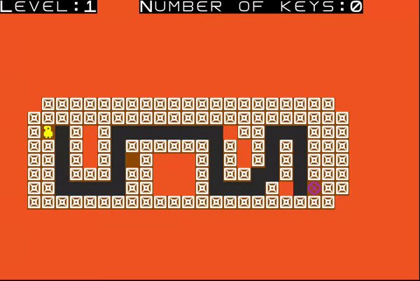
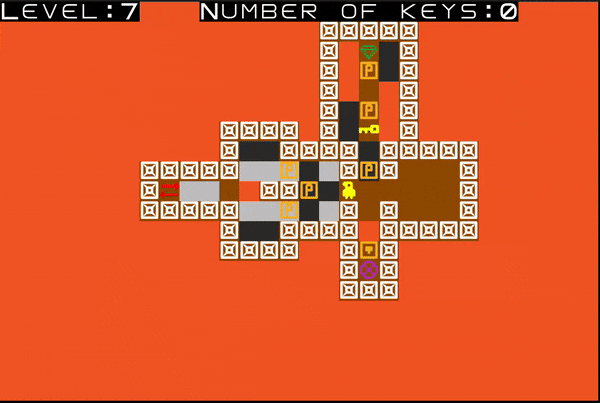
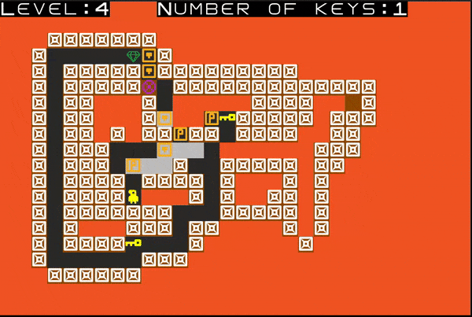
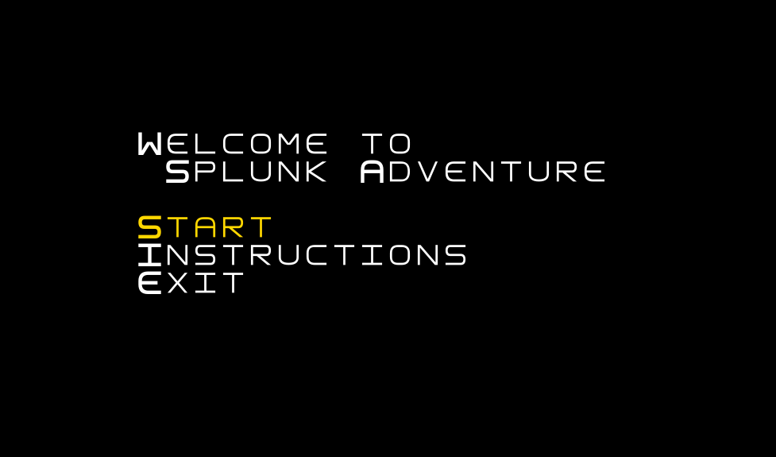
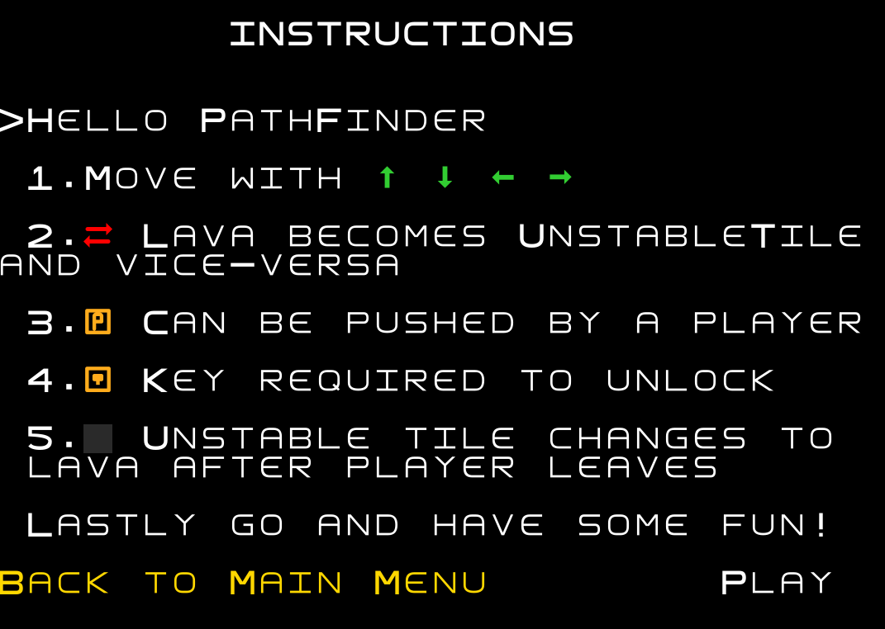
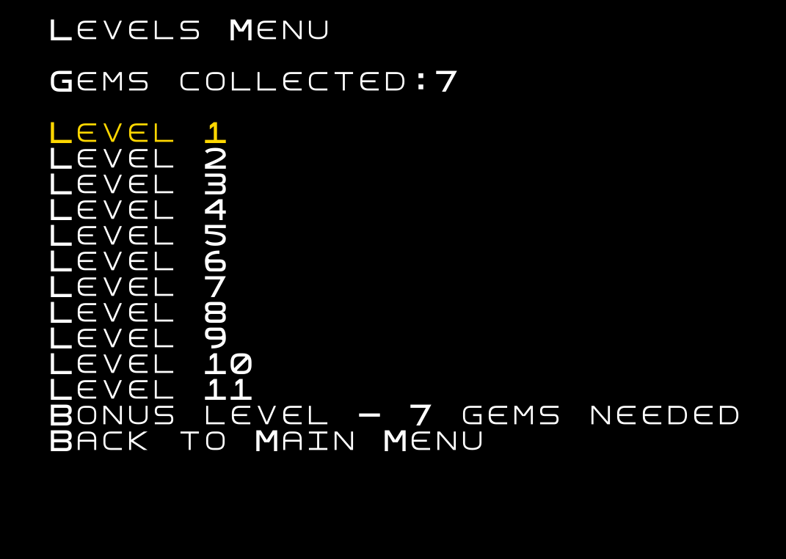
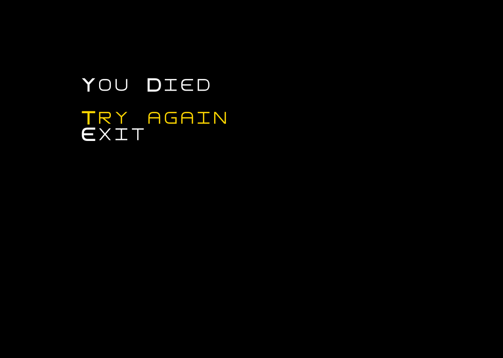
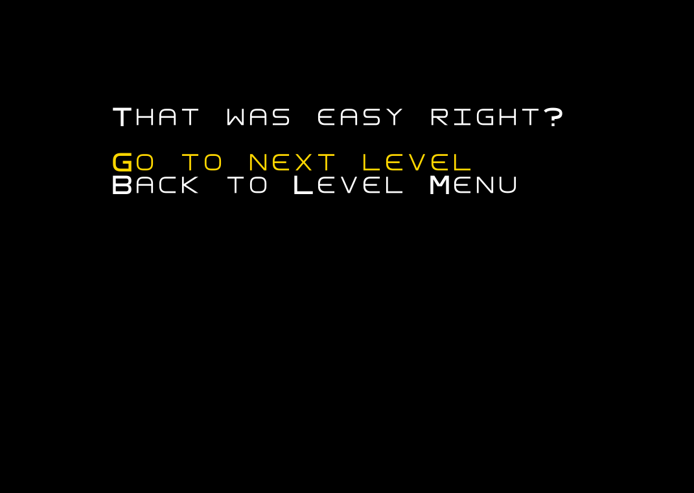
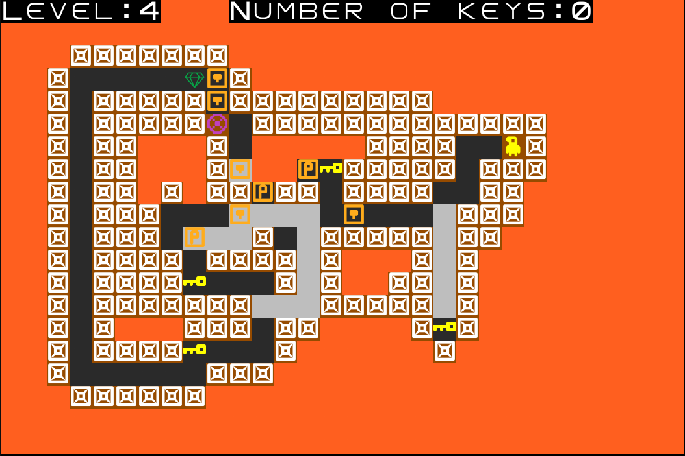
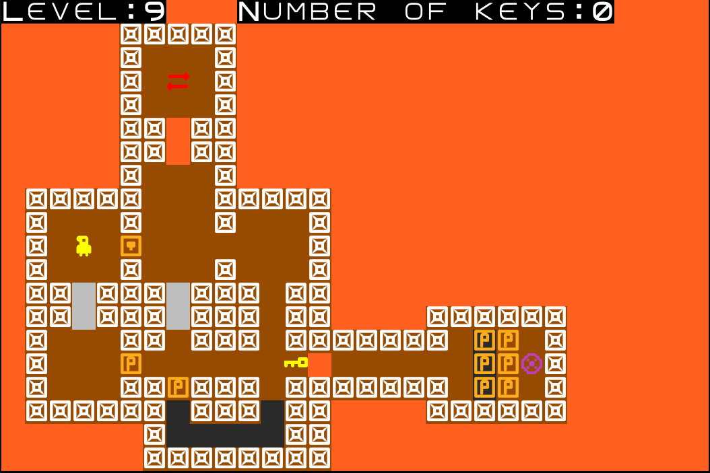

# LDTS_T02_G06 - Spelunk Adventure
## Game Description
In this puzzle game, you must navigate through dangerous caves and get to the end of the level. This seems simple but you **must** be careful because whenever you step off an unstable tile it collapses leaving a hole to the hot steaming lava below.

This project was developed by _Sérgio Nossa_ (*up202206856@fe.up.pt*) and _Pedro Marinho_ (*up202206854@fe.up.pt*).

For a more detailed version of this description click [here](docs/README.md).

## Screenshots  
  
The following screenshots ilustrate the general look of our game, as well as the divergent functionalities:  
### Game preview

  
    

  

  
  <b><i>Gif 1. Sneak peak into Spelunk Adventure game</i></b>  

  
   
 

### Inverter

  
    

  

  
  <b><i>Gif 2. Sneak peak into the inverter object</i></b>  

  
   
 

### Pushable block

  
    

  

  
  <b><i>Gif 3. Sneak peak into the pushable block object</i></b>  

  
   
 

### Menus  
  

  
    

  

  
  <b><i>Fig 1. Main Menu </i></b>  

    
  
   
 

  
    

  

  
  <b><i>Fig 2. Instructions Menu </i></b>    

    
  
   
 

  
    

  

  
  <b><i>Fig 3. Level Select Menu </i></b>  

    
  
   
 

  
    

  

  
  <b><i>Fig 4. Retry Level Menu </i></b>  

    
  
   
 

  
    

  

  
  <b><i>Fig 5. Level Complete Menu </i></b>  

    
  
   
 

### Levels

  
    

  

  
  <b><i>Fig 6. Level 4 </i></b>  

    
  
   
 

  
    

  

  
  <b><i>Fig 7. Level 9 </i></b>  

    
  
   
 

