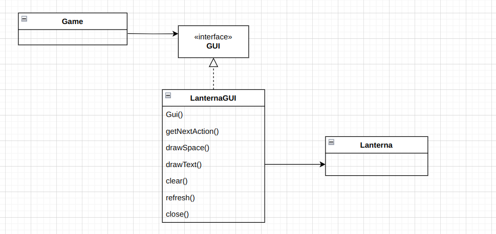

# LDTS_T02_G06 - Spelunk Adventure
## Game Description
In this puzzle game, you must navigate through dangerous caves and get to the end of the level. This seems simple but you **must** be careful because whenever you step off an unstable tile it collapses leaving a hole to the hot steaming lava below.

This project was developed by _Sérgio Nossa_ (*up202206856@fe.up.pt*) and _Pedro Marinho_ (*up202206854@fe.up.pt*).

## Implemented features

- **Connected menus** - The user can navigate through various menus to learn the rules of the game, choose a level or quit the game (Ex. MainMenu, InstructionsMenu, LevelsMenu,NextLevelMenu, RetryMenu).
- **Keyboard controls** - The game can be controlled by the UP, DOWN, LEFT and RIGHT arrows, aswell as the Q and ENTER keys.
- **Objects** - Objects are foreground elements, how they behave is dependent on their type (Ex. Gems dissapear when collected, walls block the player's movement). It's important to stress out that the Player is also an object.
- **Tiles** - Tiles are background elements, how they behave is dependent on their type (Ex. Lava kills the player, Unstable tiles turn to lava when the player steps off of them).
- **Level Unlocking** - Only one level is unlocked from the start, the rest is unlocked by beating the previous level.
- **Levels** - 12 levels of increasing difficulty were implemented, including a bonus level that unlocks after collecting 7 gems.
- **Auto-saving** - Upon level completion, the game saves so that the player can continue from where they left off without restarting.

## Planned features

- **Amongler** - the Amongler mimicks the player's movement, picking up keys, pushing blocks and dying to lava the same way the player would.

  
    

  

  
  <b><i>Fig 1. Amongler mockup </i></b>  

  
   
 

## Design
### General structure 
#### **Problem in context:** 
In order to create a game that's organized and easily modifiable, we need to make sure to use a design pattern that would divide the program into clear and distinct parts.
#### **The pattern:**
We opted to use the **Model-View-Controller** architetural pattern, which divide the implemention into three distinct parts: the model (which holds the data), the controller (which modifies the data of the model) and the view (which show the data and receives user input). These parts interact like this:

  

  <b><i>Fig 2. Model, View and Controller design pattern </i></b>

#### **Consequences:**
- Easy to manage and mantain code
- Separation of concerns

#### **Problem in context:**
We need a simple and clean way to change the content being presented and how the player can interact with the game depending on context.
#### **The pattern:** 
We used the **State** behavioral pattern which alters the behavior of an object depend on its current state.

  

  <b><i>Fig 3. State design pattern </i></b>

#### **Implementation:**
In our class *Game*, the variable state will hold one of six states (MainMenuState, LevelsMenuState, GameState, RetryState, NextLevelState, InstructionsMenuState).
The implementation of these states can be viewed in: 
- [Game](../app/src/main/java/project/l02gr06/Game.java)
- [State](../app/src/main/java/project/l02gr06/state/State.java)
- [GameState](../app/src/main/java/project/l02gr06/state/GameState.java)
- [InstructionsMenuState](../app/src/main/java/project/l02gr06/state/InstructionsMenuState.java)
- [MainMenuState](../app/src/main/java/project/l02gr06/state/MainMenuState.java)
- [LevelsMenuState](../app/src/main/java/project/l02gr06/state/LevelsMenuState.java)
- [RetryMenuState](../app/src/main/java/project/l02gr06/state/RetryMenuState.java)
- [NextLevelState](../app/src/main/java/project/l02gr06/state/NextLevelMenuState.java)
#### **Consequences:**
- Makes transitions between state more explicit
- Reinforces the single responsibility principle

### **GUI**
#### **Problem in context:**
When tacking the GUI for our program, we realized that Lanterna has various functions that aren't relevant to our implementation. Using Lanterna functions without a middle man between game functionality and Lanterna functionality would break the Interface Segregation Principle.
#### **The pattern:** 
We decided to use the **facade** pattern, in which we create a simple interface that only has acess to the functions we need:

  

  <b><i>Fig 4. Facade design pattern </i></b>

#### **Implementation:**
The implementation of this design pattern can be seen in:
- [Game](../app/src/main/java/project/l02gr06/Game.java)
- [GUI](../app/src/main/java/project/l02gr06/gui/GUI.java)
- [LanternaGUI](../app/src/main/java/project/l02gr06/gui/LanternaGUI.java)

#### **Consequences:**
- Compliance of the interface segregation principle
- Simplifies usage of the Lanterna library 

### Viewer
#### **Problem in context:**
When rendering a space in the game, the viewer must know information about the tile and object occupying that space to pass onto the drawSpace function in LanternaGUI. Determining this information using a set of nested if-clauses is messy and hard to mantain.
#### **The pattern:**
We decided to use the **Factory** creational design pattern, in which a factory class creates and returns one of many sub-classes depending on input.
#### **Implementation:**
In our implementation, Space Viewer calls getTileViewer, which returns the respective TileViewer for the tile type given, and  getObjectViewer which returns the respective ObjectViewer for the Object type given.

  

  <b><i>Fig 5. Factory design pattern </i></b>

These classes can be seen in: 
- [SpaceViewer](../app/src/main/java/project/l02gr06/viewer/game/Space/SpaceViewer.java)
- [TileViewerFactory](../app/src/main/java/project/l02gr06/viewer/game/Space/TileViewerFactory.java)
- [ObjectViewerFactory](../app/src/main/java/project/l02gr06/viewer/game/Space/ObjectViewerFactory.java)

## Known code-smells

All known code-smells were eliminated.

## Testing

### Code coverage report

  

  <b><i>Fig 6. Code coverage report </i></b>

### Mutation testing report

[Link to the mutation testing report](../docs/PitTest%20Report/pitest/index.html)

## Self evaluation

- Sérgio Nossa: 50%
- Pedro Marinho: 50%

